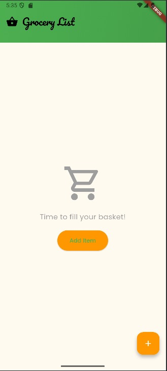

# Grocery List Application

## Overview

This file outlines the steps and guidelines to use the **Grocery List App** efficiently. The app allows users to manage their grocery items, add new ones, edit existing ones, and remove unwanted items. All data is saved locally via `SharedPreferences` to ensure persistence even after the app is closed.

Following is how the app-interface looks like:




---

## Requirements

- Flutter SDK (2.x or later)
- Dart SDK (2.x or later)
- Android/iOS Simulator or Device for testing

## Setting up the Environment

Before using the app, ensure you have the following setup:

### 1. Flutter SDK
Make sure the Flutter SDK is installed on your system.

- **Install Flutter**: [Follow the installation guide here](https://flutter.dev/docs/get-started/install).

### 2. IDE Setup
You can use any IDE such as:
- **Visual Studio Code**: Recommended for Flutter development.
- **Android Studio**: Fully integrated Flutter and Dart support.

Install the necessary Flutter and Dart plugins in your IDE.

## Installation

1. Clone the repository:

    ```bash
    git clone https://github.com/aprajitabhowal/to_do_app.git
    ```

2. Install dependencies:

    ```bash
    flutter pub get
    ```

3. Run the app on your emulator or connected device using `Main.dart`:

    ```bash
    flutter run
    ```

## File Structure

- **lib**: Contains the main application code.
  - **Main.dart**: Driver code to start the application.
  - **MyApp.dart**: Defines the theme and opens the home screen of the application.
  - **GroceryListScreen.dart**: Manages the list of grocery items and interactions.
  - **GroceryListScreenState.dart**: Manages state for displaying the added/modified grocery items.
  - **AddItemScreen.dart**: Screen for adding a new item to the grocery list.
  - **EditItemScreen.dart**: Screen for editing the details of an existing item.
  - **AddItemScreenState.dart**: Manages state for adding a new item.
  - **EditItemScreenState.dart**: Manages state for editing the details of an existing item.

- **test**: Contains the file with test cases written to test features of the app.
  - **widget_test.dart**: Contains test cases to test the addition, deletion, edit of items in the app. It also tests weather the app loads correctly, which all necessary elements placed as expected.

## Features

- **View Grocery List**: Displays all the items in the grocery list.
- **Add Item**: Allows users to add a new item with a name, quantity, and description.
- **Edit Item**: Users can edit an existing item.
- **Delete Item**: Remove an item from the list.

## Features Walkthrough and Usage

### 1. **View Grocery List**

Upon launching the app, the user is presented with the **Grocery List Screen**. The app will display all the items you have saved previously in the grocery list. The list will persist even after the app is closed and reopened.

### 2. **Add New Item**

To add a new grocery item:
1. Tap the **Add Item** (plus symbol) button.
2. Fill out the item details:
  - **Item Name**
  - **Quantity** (must be a positive integer value)
  - **Description** (optional)
3. Save the item, which will be added to the list and stored in `SharedPreferences`.

### 3. **Edit Existing Item**

To edit an existing item:
1. Tap the **Edit** (pencil) icon on the item you want to modify.
2. Make the necessary changes to the name, quantity, and/or description.
3. Save the updated details, which will replace the previous information.

### 4. **Delete Item**

To delete an item:
1. Swipe left on the item you wish to remove.
2. Tap the **Delete** button to remove the item from the list.

### 5. **Persistence**

The app uses `SharedPreferences` to store the grocery list locally. As a result:
- The list will be preserved even after closing the app.
- Items added or modified are automatically saved to `SharedPreferences`.

